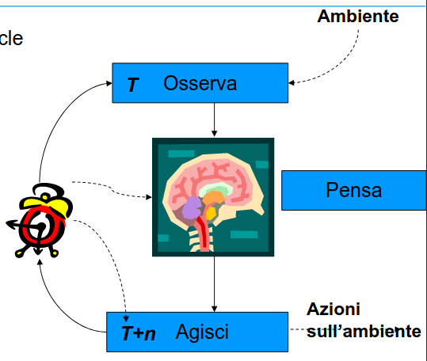

- PROGRAMMA
	- ambiente in cui elaborare una BASE DI CONOSCENZA
	- tipologie di conoscenza
	- BASE DI CONOSCENZA
	  id:: 64099770-7277-4ef6-a541-193c3a25094a
		- conoscenza sul dominio dell'applicazione
	- CONTROLLO
	  id:: 6409977e-c77f-48fd-b090-0267232dc9cd
		- conoscenza su come sfruttare la conoscenza per risolvere i problemi
	- quindi un programma è formato da ((64099770-7277-4ef6-a541-193c3a25094a)) e ((6409977e-c77f-48fd-b090-0267232dc9cd))
	-
- ESEMPIO PRESCRIBE DRUG
	- base di conoscenza formata da fatti e regole
	- 
	- controllo formato da albero
	- 
	- albero generato dinamicamente dal sistema
- ARCHITETTURA GENERALE DEL SISTEMA
	- 
- ragionamenti
	- forward o data driven
		- parte da i dati per inferire la soluzione
		- la memoria  di lavoro è composta inizialmente solo dai fatti
		- all'esecuzione di una regola viene aggiornata la memoria di lavoro con nuovi fatti
	- backward
		- parte dall'obbiettivo per sintetizzare le soluzioni
		- la memoria di lavoro è inizzializzata con il goal da raggiungere
		- all'esecuzione di una regola viene aggiornata la memoria di lavoro con i sottogoal da conseguire
- AGENTI RAZIONALI
	- agenti in grado di interagire con l'ambiente
	- {:height 464, :width 539}
	- aggiornamento dello stato
	- generazione del problema
	- genera la sequenza di azioni per risolvere il problema *algoritmo di search*
	- esegue la sequenza di azioni per raggiungere il goal
	- ALGORITMO DI SEARCH
		- dato il problema genera la soluzione
		- metodologie
			- ricerca in uno spazio degli stati
				- SPAZIO DEGLI STATI
					- insieme degli stati raggiungibili dallo stato iniziale con una sequenza di operatori
					- stato iniziale
						- stato in cui l'agente si trova
					- insieme  di azioni
						- insieme delle azioni da intraprendere
					- cammino
						- sequenza di azioni che conduce da uno stato a un altro
				- TEST DI RAGGIUNGIMENTO DEL GOAL
					- lo stato raggiunto puo appartenere a un insieme di stati goal
					- altre volte la descrizione dello stato di goal puo essere astratto
					- si puo voler raggiungere la soluzione migliore
						- necessaria funzione costo
					- esempio /
						- ricerca percorso ottimale da Arad a Bucharest
			-
				-
				-
				-
	-