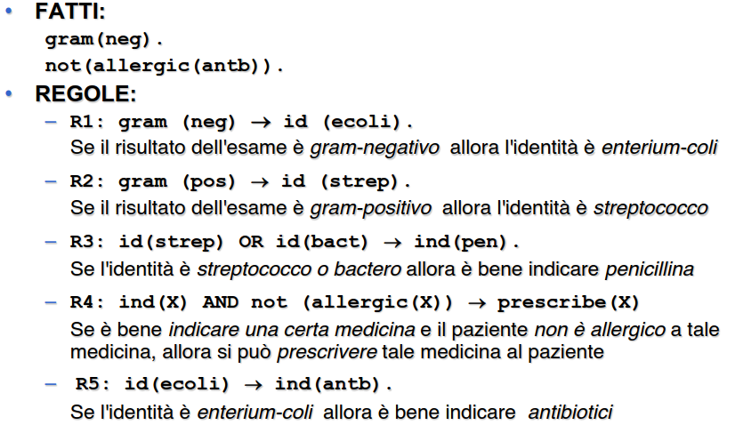
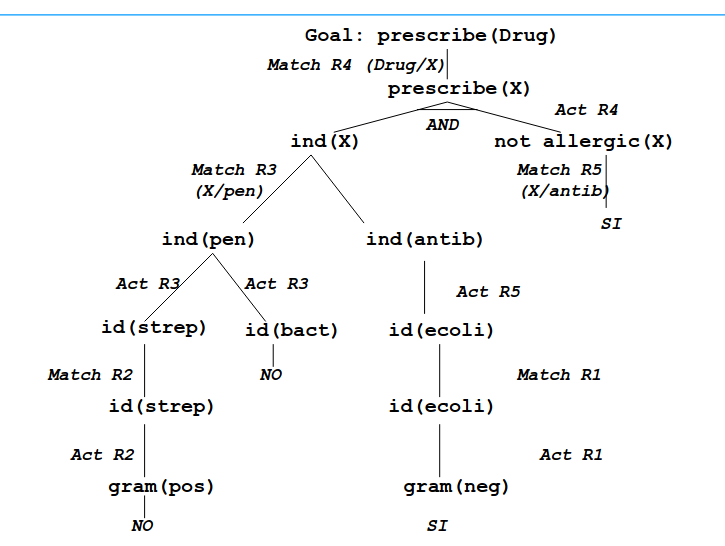

- PROGRAMMA
	- ambiente in cui elaborare una BASE DI CONOSCENZA
	- tipologie di conoscenza
	- BASE DI CONOSCENZA
	  id:: 64099770-7277-4ef6-a541-193c3a25094a
		- conoscenza sul dominio dell'applicazione
	- CONTROLLO
	  id:: 6409977e-c77f-48fd-b090-0267232dc9cd
		- conoscenza su come sfruttare la conoscenza per risolvere i problemi
	- quindi un programma è formato da ((64099770-7277-4ef6-a541-193c3a25094a)) e ((6409977e-c77f-48fd-b090-0267232dc9cd))
	-
- ESEMPIO PRESCRIBE DRUG
	- base di conoscenza formata da fatti e regole
	- 
	- controllo formato da albero
	- 
	- albero generato dinamicamente
-