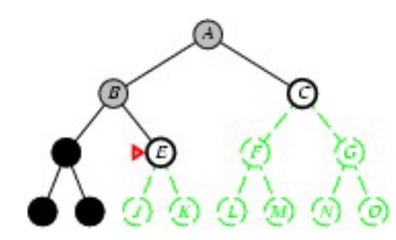

- [[RICERCA DELLE SOLUZIONI]]
	- l'agente deve mantenere in memoria una serie di soluzioni parziali che conducono a un esito sconosciuto da poter analizzare
		- #### processo di ricerca
			- inteso come la costruzione di un albero
				- nodi= stati
				- rami= operatori
			- ad ogni azione si deve decidere quale stato espandere
			- #### fase di espansione
				- l'agente genera il sottoalbero dato un operatore e uno stato iniziale
				- l'agente non attua l'operatore, genera solo l'albero
				- ##### quale  ramo espandere?
					- situazione di non determinismo
					- necessario adottare strategia di espansione
				- arrivato alle foglie dell'albero l'agente può avere due possibilità
					- foglia GOAL
					- foglia FALLIMENTO
				-
			- 
			- #### ESEMPIO
				- ricerca del percorso da Arad a Bucharest
				- 
			- #### CONTENUTO DEL NODO
				- stato che rappresenta
				- operatore applicato per ottenere il nodo
				- costo del cammino dallo stato iniziale
				- la profondita del nodo
				- link ai nodi figli e al nodo padre
			- #### PSEUDO IMPLEMENTAZIONE
			- 
				- l'agente partendo da un problema genera il nodo radice
				- lo inserisce nella lista di nodi
				- verifica se il nodo è il goal
					- se è il goal genera la sequenza di azioni per raggiungerlo
					- se non lo è espande la lista e ripete
						- vengono generati i nodi successori visti come un insieme di azione e stato
						- memorizza la profondità del nodo
						- costruisce la struttura e la restituisce
			- ##### IL SISTEMA RIESCE A TROVARE UNA SOLUZIONE?
				- è possibile non trovarne come trovarne di sbagliate
			- ##### È UNA SOLUZIONE OTTIMA?
				- con costo minore di cammino
			- ##### QUAL'È IL COSTO DELLA RICERCA?
				- costo del cammino + costo della ricerca
	- #### STRATEGIA
		- informazione sulla conoscenza applicata disponendo di piu possibilità
		- #### STRATEGIE NON INFORMATE
			- strategie che non sono a conoscenza del dominio applicativo
		- #### STRATEGIE INFORMATE
			- strategie che conoscono il dominio applicativo
		- #### CRITERI DI VALUTAZIONE
			- ##### completezza
			- TODO completare criteri di valutazione
			- ##### complessita spaziale
			  id:: 640b1c39-c598-41a4-8a47-e7417df9bbb8
			- ##### complessita temporale
			  id:: 640b1c46-7eb7-4316-a186-682e4ef1557d
			- ##### ottimalita
		- #### PROFONDITA
			- la profondita del nodo di partenza è 0 e la profondita di un nodo x è quella del suo genitore +1
		- #### STRATEGIA BREADTH-FIRST
		  id:: 640b1d0a-beb1-4247-b1ba-59bf87d88dec
			- espande sempre i nodi meno profondi dell'albero
			- ((640b1c46-7eb7-4316-a186-682e4ef1557d)) e ((640b1c39-c598-41a4-8a47-e7417df9bbb8)) b^d
				- complessità esponenziale di esecuzione
			- trova sempre la soluzione ottimale se il costo è indicato come la profondità del goal
		- #### STRATEGIA A COSTO UNIFORME
			- viene selezionato per l'espansione il nodo a costo minimo
			- il goal test viene effettuato prima dell'espansione del nodo
		- #### STRATEGIA DEPTH-FIRST
			- espande i nodi piu profondi
				- a parita di profondita la selezione è arbitraria
			- ((640b1c39-c598-41a4-8a47-e7417df9bbb8)) ridotta rispetto a ((640b1d0a-beb1-4247-b1ba-59bf87d88dec)) non è necessario tenere attivi tutti i rami dell'albero una volta esplorati
			- 
			- possibile gestirla con uno stack
			- s
			-
			-
			-
	-
		-
-