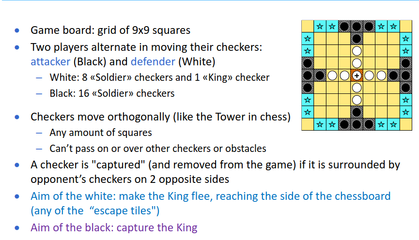

- # ALBERI AND/OR
	- appropriati per risolvere problemi scomponibili in sottoproblemi
	- il ramo AND i cui nodi figli si devono tutti risolvere per risolvere il nodo and
	- 
	- ### nb
		- l'ordine di espansione non ha alcuna influenza per il raggiungimento del goal
	- ### TECNICHE EURISTICHE
		- in domini non formalizzati non si utilizzano funzioni euristiche
		- #### inserito implicitamente in dall'utente
		- #### inserito esplicitamente in dall'utente
		- #### definita dagli operatori
- # GIOCHI
	- ambienti in cui l'agente non è l'unica entità a interagire con il mondo
	- l'agente deve ricercare la soluzione con degli avversari
	- lo svolgersi del gioco può essere rappresentato come un albero con uno stato iniziale come radice (es configurazione della scacchiera di partenza)
	- ### costruzione dell'albero
		- l'agente costruisce l'albero delle possibili scelte per determinare quale mossa eseguire
		- alla prossima iterazione l'agente ricostrusce l'albero partendo dal nuovo stato iniziale
		- #### algoritmo min max
			- pensato per determinare la strategia ottimale per trovare la prossima mossa
	- ## GIOCO
		- si gioca a tablut
			- nessuno sa le regole arrivano da una traduzione dal latino di un tizio che guardava  dei tizi giocare
			- 
			- {:height 165, :width 501}
			- check [rules](https://virtuale.unibo.it/pluginfile.php/1589188/mod_resource/content/0/PresentazioneChallenge2223.pdf)
			- si puo partecipare a gruppi max 4 persone
			- timeout di un minuto massimo
			- server java che comunica all'agente lo stato del gioco e si attende la mossa
			- discussione post gara del giocatore
			- scadenza consegna [[May 14th, 2023]]
			- scadenza iscrizione non obbligatoria [[Apr 16th, 2023]]
			-
		-
	-
	-