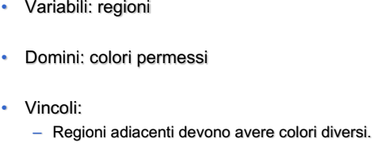
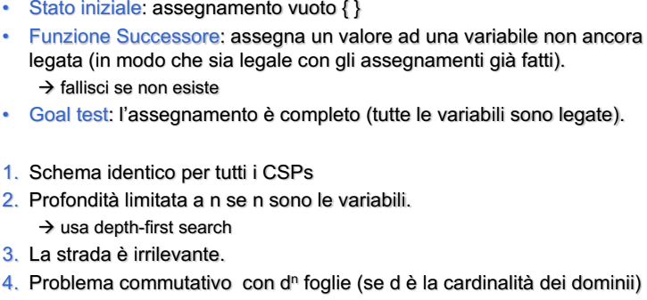

- ((641453b2-d84c-450a-b1a8-9e93d6ac7f82))
	- dato uno stato qualunque del gioco l'agente deve trovare la prossima mossa da eseguire
	- ((641456dd-32f3-4ceb-b9b2-82dc044251c9))
- ## SODDISFACIMENTO DI VINCOLI
	- molti problemi possono essere visti come soddisfacimento di vincoli
	- CSP (constraint satisfaction problem)
	- **OBBIETTIVO**
		- trovare uno stato del problema che li soddisfa
	- #### DEFINIZIONE
	- (x1,....,xn) insieme di variabili
	- (d1,......,dn) valori ammissibili
	- #### ESEMPI
		- ##### ESEMPIO DELLE 8 REGINE
			- 
			- 
		- ##### ESEMPIO DELLO SCHEDULING
			- assegnare attività che hanno una certa durata a risorse
			- 
		- ##### ESEMPIO MAP COLORING
			- 
			- 
		- ##### ESEMPIO CRIPTOARITMETICA
			- 
	- #### CSP COME PROBLEMA DI RICERCA NELLO SPAZIO DEGLI STATI
		- **stato**
			- è dato dalle variabili e  da un set dei possibili valori determinati dai domini
		- **goal test**
			- è l'insieme dei vincoli che quelle variabili devono rispettare
		- **nodi foglia**
			- nodi in cui tutte le variabili hanno un valore
		- **operatori**
			- assegnamenti di valori alle variabili
		- ##### possibile algoritmo di ricerca
			- 
			- questo approccio fa si che la complessità esploda rapidamente
			- corretto approccio **rilevare subito i rami di fallimento**
			-
		-
	-