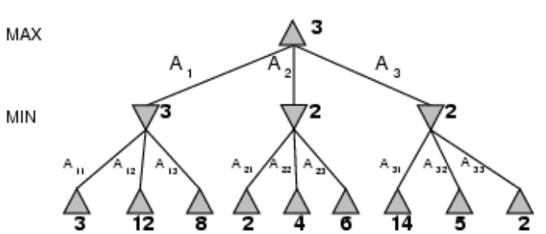

- ((641453b2-d84c-450a-b1a8-9e93d6ac7f82))
	- dato uno stato qualunque del gioco l'agente deve trovare la prossima mossa da eseguire
	- #### ALGORITMO MIN MAX
		- esempio del tris
			- 
			- nello stato iniziale l'agente costruisce l'albero dei possibili sviluppi del gioco
			- le foglie vengono etichettate in base allo stato che rappresentano (vittoria/sconfitta/pareggio)
			- ##### fase di propagazione delle label
			  id:: 642539fa-c1ea-48fb-a241-61c9ce4c7e86
				- l'agente deve propagare il valore delle foglie ai nodi figli dello stato di partenza in questo modo è in grado di eseguire la scelta
				- la propagazione della label assume il valore minimo tra i figli
		- ((640b1c21-d260-46d3-bc78-cb50f97d63cc)) si
		- ((640b1c4b-fe83-4c82-be38-9c458cd40b5d))
			- si se l'avversario gioca al meglio
		- ((640b1c46-7eb7-4316-a186-682e4ef1557d))
			- la complessità equivale a b^n
		- ((640b1c39-c598-41a4-8a47-e7417df9bbb8))
			- possibile ridurla con sviluppo dell'albero con ((640b20a1-4658-4b89-b6a5-654c8667fd14))
			- in questo caso la ((642539fa-c1ea-48fb-a241-61c9ce4c7e86)) viene eseguita inizializzando il nodo a un valore - infinito (esempio ricerca del massimo)
		- **ALBERO TROPPO GRANDE, NECESSARIO POTARE**
			- soluzione: si espande l'albero fino a una certa profondita
			- si utilizzano funzioni di valutazione per stimare la *bontà* di un certo nodo
				- funzioni eurisitche
			- in questo caso le capacita dell'agente dipendono molto dalla funzione euristica
			- la funzione euristica aumenta di molto l'esigenze computazionali della macchina
			- ##### CONSIDERAZIONI SU CUTOFF
				- la soluzione di imporre un cutoff generale p molto naive
				- non tutte le mosse sono particolarmente utili
				- necessario tagliare selettivamente l'albero
				- #### TAGLIO ALFA BETA
					- la ricerca si ferma al nodo che contiene la mossa vincente
					- 
					- si sfruttano due bound (alfa/beta) se beta è minore di alfa il ramo non viene ulteriormente espanso
					- 
					-
					-
			-
			-