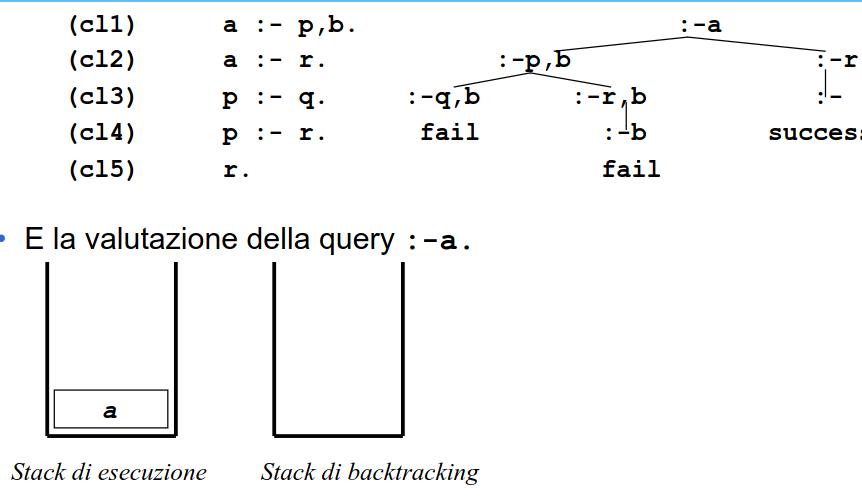

- # CONTROLLO DI UN PROGRAMMA
	- puo essere utile avere costrutti per influenzare l'esecuzione a runtime
	- sporcano la logica
	- utili a fini ingegneristici e di prestazioni
	- ### RAPPRESENTAZIONE DELLA MACCHINA A RUNTIME
		- due stack uno per gli stati dell'albero e l'altro per le scelte aperte
		- 
		-
	- ### PREDICATO CUT
		- lo scopo è quello di rimuovere possibilità di scelta da un certo ramo in poi
		- 

