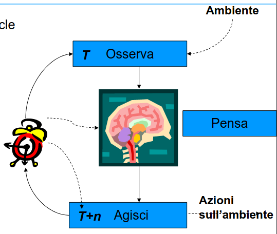
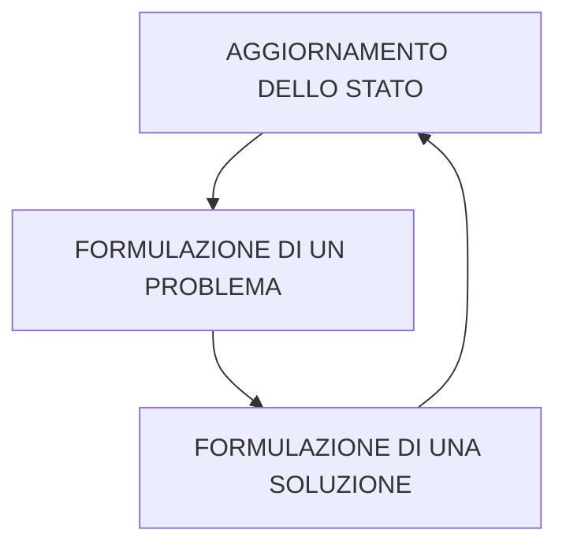

# AGENTI RAZIONALI

agenti in grado di interagire con un ambiente

## ENGINE DI UN AGENTE RAZIONALE

 il workflow di un agente razionale si puo riassumere come segue:

La ricerca di una soluzione viene eseguita per mezzo di algoritmi di ricerca

--------------------------------
	- #### aggiornamento dello stato
		- l'agente osserva l'ambiente circostante e acquisisce informazioni
	- #### generazione del problema
		- l'agente genera un problema da risolvere
	- #### genera la sequenza di azioni per risolvere il problema ( [[ALGORITMO DI SEARCH]] )
		- l'agente genera la soluzione
	- #### esegue la sequenza di azioni per raggiungere il goal
		- esegue la soluzione
- [[ALGORITMO DI SEARCH]]
- PROPRIETÀ DEL PROBLEMA
	- #### SCOMPONIBILITA
		- capacita di un problema di essere scomposto in sottoproblemi più semplici
		-
		- non sempre il problema è scomponibile
			- questo è dovuto alla natura dei problemi del mondo reale
			- esempio
- TIPOLOGIE DI PROBLEMI
	- PROBLEMA A STATI SINGOLI
	  id:: 6409b42a-6a79-4d5e-a3ed-8179929c5785
		- l'agente è a conoscenza di tutte le azioni e sa in quale stato si troverà dopo ogni sua azione
		- l'agente è il solo elemento a interagire con l'ambiente
		- ipotesi molto forti e semplificative poco applicabili alla realta
	- PROBLEMA A STATI MULTIPLI
		- lo stato non è completamente noto all'agente a priori
		- l'effetto delle azioni non è noto a priori