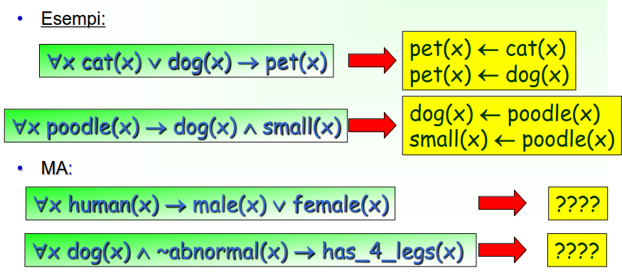
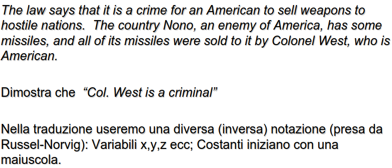
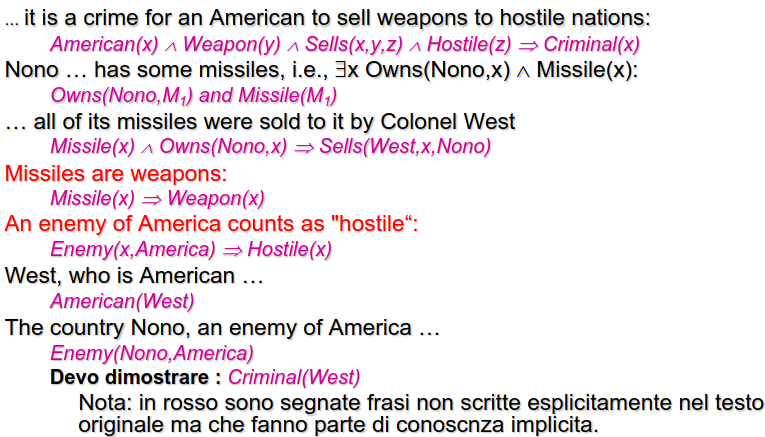
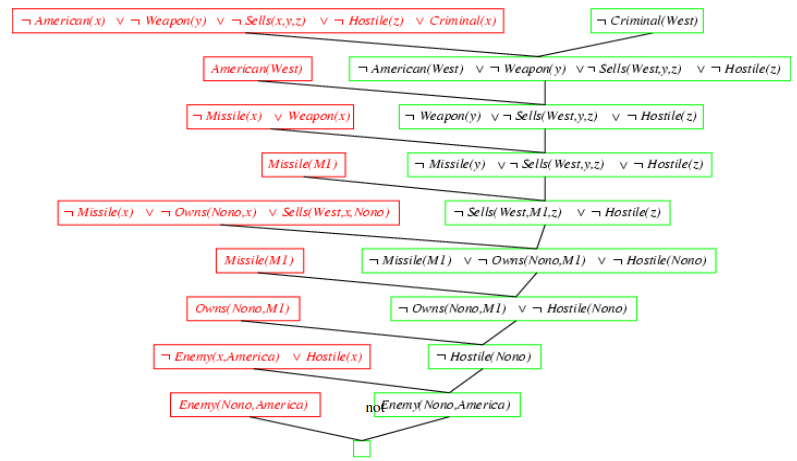

- sottoinsieme della logica a clausole
- **hanno al piu un letterale positivo**
- 
- molte formule della logica dei predicati possono essere riscritte in clausole di horn
	- 
- ### RISOLUZIONE DELLE CLAUSOLE DI HORN
	- risoluzione SLD (*selection rule linear input define clauses*)
- ### DIGRESSIONE SULLA COMPRENSIONE DEL LINGUAGGIO NATURALE
	- ad oggi uno dei problemi piu attuali è la trasformazione  da linguaggio naturale a linguaggio logico
	- si sfruttano statistiche
	-
- ## ESEMPIO ESERCIZIO DI ESAME RISOLUZIONE
	- 
	- 
	- 
	-