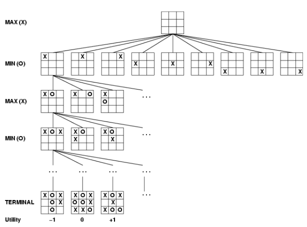
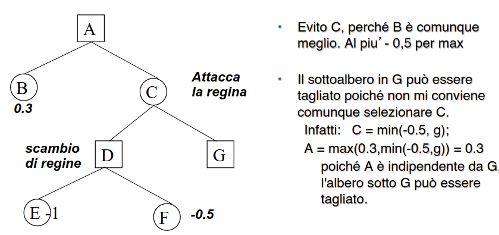
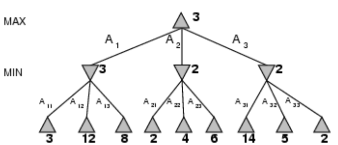

- ambienti in cui l'agente non è l'unica entità a interagire con il mondo
- l'agente deve ricercare la soluzione con degli avversari
- lo svolgersi del gioco può essere rappresentato come un albero con uno stato iniziale come radice (es configurazione della scacchiera di partenza)
- ### costruzione dell'albero
	- l'agente costruisce l'albero delle possibili scelte per determinare quale mossa eseguire
	- alla prossima iterazione l'agente ricostruisce l'albero partendo dal nuovo stato iniziale
- ## ALGORITMO MIN MAX
  id:: 641456dd-32f3-4ceb-b9b2-82dc044251c9
	- pensato per determinare la strategia ottimale per trovare la prossima mossa
	- punta a determinare la mossa migliore per max ipotizzando che min faccia la mossa a lui più conveniente
	- esempio del tris
		- 
		- nello stato iniziale l'agente costruisce l'albero dei possibili sviluppi del gioco
		- le foglie vengono etichettate in base allo stato che rappresentano (vittoria/sconfitta/pareggio)
		- ##### fase di propagazione delle label
			- l'agente deve propagare il valore delle foglie ai nodi figli dello stato di partenza in questo modo è in grado di eseguire la scelta
			- la propagazione della label assume il valore minimo tra i figli
	- ((640b1c21-d260-46d3-bc78-cb50f97d63cc)) si
	- ((640b1c4b-fe83-4c82-be38-9c458cd40b5d))
		- si se l'avversario gioca al meglio
	- ((640b1c46-7eb7-4316-a186-682e4ef1557d))
		- la complessità equivale a b^n
	- ((640b1c39-c598-41a4-8a47-e7417df9bbb8))
		- possibile ridurla con sviluppo dell'albero con ((640b20a1-4658-4b89-b6a5-654c8667fd14))
		- in questo caso la ((642539fa-c1ea-48fb-a241-61c9ce4c7e86)) viene eseguita inizializzando il nodo a un valore - infinito (esempio ricerca del massimo)
	- **ALBERO TROPPO GRANDE, NECESSARIO POTARE**
		- soluzione: si espande l'albero fino a una certa profondita
		- si utilizzano funzioni di valutazione per stimare la *bontà* di un certo nodo
			- funzioni eurisitche
		- in questo caso le capacita dell'agente dipendono molto dalla funzione euristica
		- la funzione euristica aumenta di molto l'esigenze computazionali della macchina
		- ##### CONSIDERAZIONI SU CUTOFF
			- la soluzione di imporre un cutoff generale p molto naive
			- non tutte le mosse sono particolarmente utili
			- necessario tagliare selettivamente l'albero
			- #### TAGLIO ALFA BETA
				- la ricerca si ferma al nodo che contiene la mossa vincente
				- 
				- si sfruttano due bound (alfa/beta) se beta è minore di alfa il ramo non viene ulteriormente espanso
				- 
				- **EFFICACIA**
					- i tagli sono efficaci quando i nodi migliori sono valutati per primi
					- se tutti i nodi sono ordinati per posizionare per primi i nodi migliori si passa da b^d a b^(d/2)
					- l'albero può essere esplorato fino al doppio della profondità
-
-