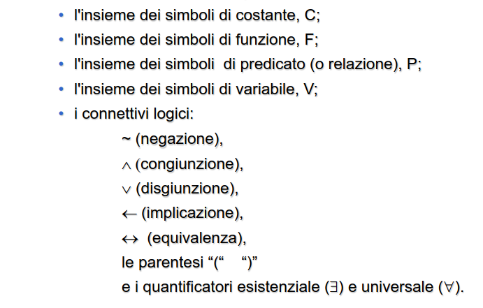

- consente di analizzare le inferenze
- controllare la validità di predicati
- fare deduzioni
- stabilire la consistenza di una teoria
- ## LOGICA CLASSICA
	- due principali tipologie
		- ### LOGICA PROPOSIZIONALE
		- ### LOGICA DEI PREDICATI
			- possibile definire variabili e quantificazioni
			- #### SINTASSI
				- 
				- ##### COSTANTI
					- singole entità del dominio
				- ##### VARIABILI
					- entità non note al dominio
				- ##### FUNZIONI N-ARIE
					- individua univocamente un oggetto del dominio tramite relazioni tra N oggetti del dominio
				- ##### PREDICATI N-ARI
					- generica relazione tra oggetti del dominio che può essere vera o falsa
				- ##### TERMINE
					- dato f una funzione n-aria e t1....tn i termini f(t1....tn) è un termine
					- una variabile è un termine
					- una costante è un termine
				-
			- #### SEMANTICA
				-