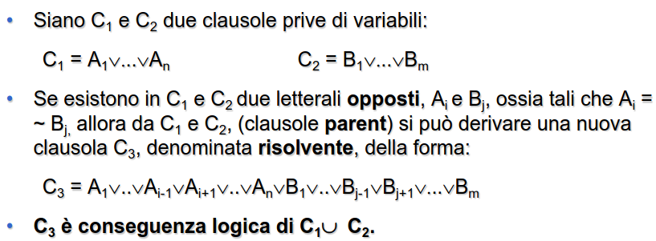

- consente di analizzare le inferenze
  id:: 6437c54c-5e1f-4f75-b8cf-d2b8c81fc479
- controllare la validità di predicati
- fare deduzioni
- stabilire la consistenza di una teoria
- ### CARATTERISTICHE
	- #### POTENZA ESPRESSIVA
		- capacità di esprimere concetti di alto livello
	- #### EFFICIENZA
		- capacita di strutturare la conoscenza in maniera da rendere l'accesso più veloce
	- #### FLESSIBILITÀ MODIFICABILITÀ, ESTENSIBILITÀ
	- #### FACILE COMPRENSIONE DELLA NOTAZIONE
### DIFFERENZA TRA BASE DATI E BASE DI CONOSCENZA
	- una base di conoscenza è in grado di **inferire nuova conoscenza da quella presente**
	- una base dati contiene solo fatti positivi ma **non è in grado di inferire nulla**
### TRADE-OFF FONDAMENTALE
	- ottenere un sistema di rappresentazione della **conoscenza espressivo**
	- ottenere un sistema di rappresentazione della **conoscenza efficiente**
- ## LOGICA CLASSICA
	- due principali tipologie
		- ### LOGICA PROPOSIZIONALE
			- logica piu semplice, molto meno espressiva
			- ### PRINCIPIO DI RISOLUZIONE
				- si applica a formule logiche espresse in **forma a clausole**
				- regola di inferenza base usata nella logica
				- 
				- crea una nuova clausola escludendo i letterali opposti
			- ### CLAUSOLE
				- disgiunzione di letterali negati e non negati
				- #### CLAUSOLE DEFINITE
					- clausole in cui un **solo letterale è positivo**
		- [[LOGICA DEI PREDICATI]]