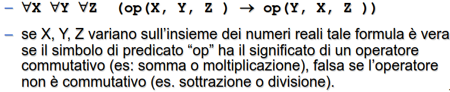

- consente di analizzare le inferenze
  id:: 6437c54c-5e1f-4f75-b8cf-d2b8c81fc479
- controllare la validità di predicati
- fare deduzioni
- stabilire la consistenza di una teoria
- ## LOGICA CLASSICA
	- due principali tipologie
		- ### LOGICA PROPOSIZIONALE
		- ### LOGICA DEI PREDICATI
			- possibile definire variabili e quantificazioni
			- #### SINTASSI
				- 
				- ##### COSTANTI
					- singole entità del dominio
				- ##### VARIABILI
					- entità non note al dominio
				- ##### FUNZIONI N-ARIE
				  id:: 6437c86a-e75b-49aa-9772-3530ef5aa06c
					- individua univocamente un oggetto del dominio tramite relazioni tra N oggetti del dominio
				- ##### PREDICATI N-ARI
				  id:: 6437c863-5f26-4d71-898b-7dba5defde07
					- generica relazione tra oggetti del dominio che può essere vera o falsa
				- ##### TERMINE
					- dato f una funzione n-aria e t1....tn i termini f(t1....tn) è un termine
					- una variabile è un termine
					- una costante è un termine
				- #### FORMULE BEN FORMATE (FBF)
					- frasi sintatticamente corrette del linguaggio
					- una FBF si può ottenere combinando formule atomiche del
				- #### FBF FORMA NORMALE DISGIUNTIVA PRENESSA
					- disgiunzione di una o più FBF composte da congiunzioni di letterali; le quantificazioni compaiono tutte in testa a F
				- #### FBF FORMA NORMALE CONGIUNTIVA PRENESSA
					- congiunzione di una o più FBF composte da disgiunzioni di letterali; le quantificazioni compaiono tutte in testa ad F
			- #### SEMANTICA
				- nasce dalla necessita di associare un significato ai simboli
				- necessario definire un interpretazione dei simboli che costituisce l'associazione tra la realtà del dominio in questione e il suo modello che lo rappresenta
				- **non si può determinare a priori se una formula è vera o falsa**
				- ### INTERPRETAZIONE
				  id:: 6437cdea-3c6c-4a5a-9a4f-fe31ab35c44b
					- dato un linguaggio del primo ordine definisce un insieme D tale che
						- a ogni costante si associa un simbolo di D
						- a ogni  ((6437c86a-e75b-49aa-9772-3530ef5aa06c)) una funzione F:D^n->D
						- a ogni ((6437c863-5f26-4d71-898b-7dba5defde07)) si associa un sottoinsieme di D^n
					- ##### esempio
						- 
					- #### VALORE DI VERITÀ DI UNA FBF
						- una formula atomica ground è vera se il predicato è soddisfatto
						- il valore di verita una formula composta si ottiene dalle tabelle della verita degli operatori che la compongono
						- 
				- ### MODELLI
					- data un ((6437cdea-3c6c-4a5a-9a4f-fe31ab35c44b)) I una FBF chiusa F
					- **I è un modello per F se F è vera in I**
					- #### SODDISFACIBILITÀ
						- F è soddisfacibile se **esiste I modello per F**
						- ##### esempio FBF non soddisfacibile
							- `A and !A`
					- #### FBF LOGICAMENTE VALIDA
						- se ogni ((6437cdea-3c6c-4a5a-9a4f-fe31ab35c44b)) è modello di F
				-