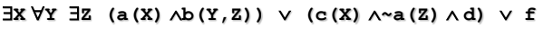
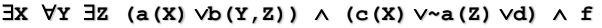
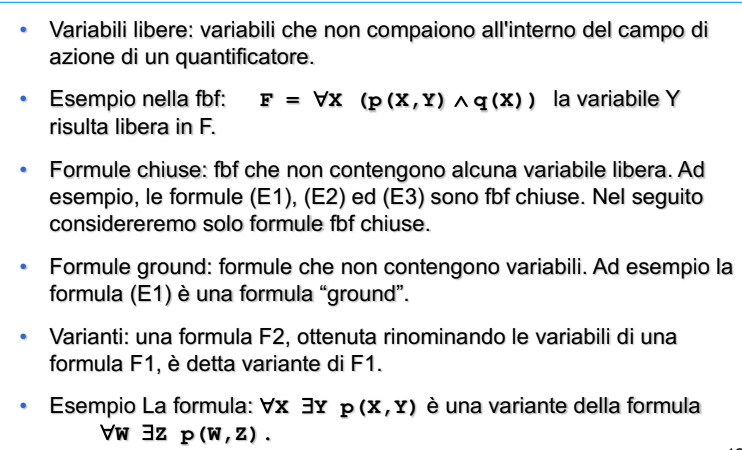
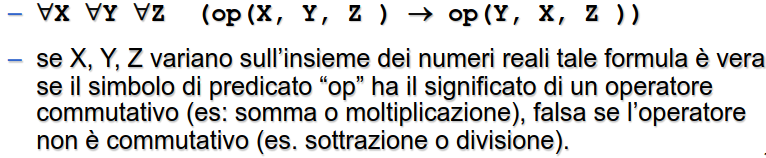
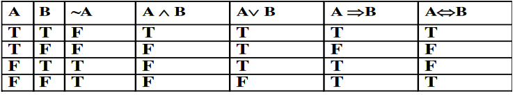
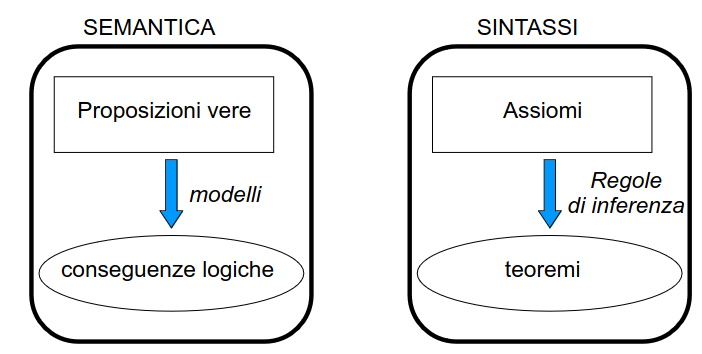
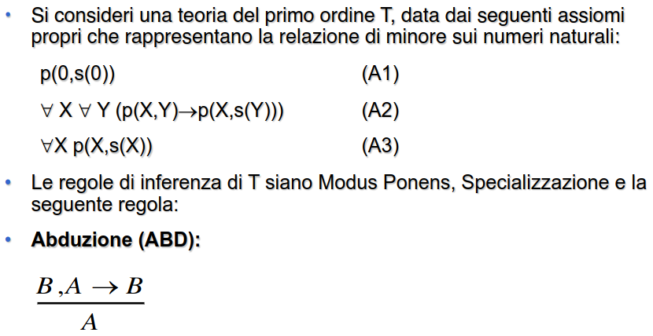

- possibile definire variabili e quantificazioni
- # SINTASSI
	- simboli di costante **C**
	- simboli di funzione **F**
	- simboli di predicato **P**
	- simboli di variabile **V**
	- connettori logici
		- negazione **~**
		- congiunzione **^**
		- disgiunzione **v**
		- implicazione **<-**
		- equivalenza **<-->**
	- ##### COSTANTI
		- singole entità del dominio
	- ##### VARIABILI
		- entità non note al dominio
	- ##### FUNZIONI N-ARIE
	  id:: 6437c86a-e75b-49aa-9772-3530ef5aa06c
		- individua univocamente un oggetto del dominio tramite relazioni tra N oggetti del dominio
	- ##### PREDICATI N-ARI
	  id:: 6437c863-5f26-4d71-898b-7dba5defde07
		- generica relazione tra oggetti del dominio che può essere vera o falsa
	- ##### TERMINE
		- dato f una funzione n-aria e t1....tn i termini f(t1....tn) è un termine
		- una variabile è un termine
		- una costante è un termine
	- ## FORMULE BEN FORMATE (FBF)
		- **frasi sintatticamente corrette del linguaggio**
		- una FBF si può ottenere combinando formule atomiche e mediante i connettori logici
	- #### FBF FORMA NORMALE DISGIUNTIVA PRENESSA
		- disgiunzione di una o più FBF composte da congiunzioni di letterali; le quantificazioni compaiono tutte in testa a F
		- ##### ESEMPIO
			- 
	- #### FBF FORMA NORMALE CONGIUNTIVA PRENESSA
		- congiunzione di una o più FBF composte da disgiunzioni di letterali; le quantificazioni compaiono tutte in testa ad F
		- ##### ESEMPIO
			- 
		- ##### NOMENCLATURE FORMULE
			- 
- # SEMANTICA
	- ogni sistema formale è la modellizzazione di una realtà
	- nasce dalla necessita di **associare un significato ai simboli**
	- necessario definire un interpretazione dei simboli che costituisce l'associazione tra la realtà del dominio in questione e il suo modello che lo rappresenta
	- **non si può determinare a priori se una formula è vera o falsa**
	- ### INTERPRETAZIONE
	  id:: 6437cdea-3c6c-4a5a-9a4f-fe31ab35c44b
		- dato un linguaggio del primo ordine definisce un insieme D tale che
			- a ogni costante si associa un simbolo di D
			- a ogni  ((6437c86a-e75b-49aa-9772-3530ef5aa06c)) una funzione F:D^n->D
			- a ogni ((6437c863-5f26-4d71-898b-7dba5defde07)) si associa un sottoinsieme di D^n
		- ##### esempio
			- 
		- #### VALORE DI VERITÀ DI UNA FBF
			- una formula atomica ground è vera se il predicato è soddisfatto
			- il valore di verita una formula composta si ottiene dalle tabelle della verita degli operatori che la compongono
			- 
	- ### MODELLI
		- data un ((6437cdea-3c6c-4a5a-9a4f-fe31ab35c44b)) I una FBF chiusa F
		- **I è un modello per F se F è vera in I**
		- #### SODDISFACIBILITÀ
			- F è soddisfacibile se **esiste I modello per F**
			- ##### esempio FBF non soddisfacibile
				- `A and !A`
		- #### FBF LOGICAMENTE VALIDA
			- se ogni ((6437cdea-3c6c-4a5a-9a4f-fe31ab35c44b)) è modello di F
			- ##### esempio FBF logicamente valida
				- `A OR !A`
		- ### INSIEMI DI FORMULE SODDISFACIBILI
			- un insieme di formule del primo ordine è soddisfacibile **se esiste un Interpretazione I che è modello per tutte le formule di S**
	- ### CONSEGUENZA LOGICA
	  id:: 64392ba2-1bc5-46a5-b086-6184ff3b783f
		- dato un insieme di formule S una formula F è conseguenza logica se e solo se **ogni interpretazione I che è un modello per S lo è anche per F**
		- concetto fondamentale per **derivare conoscenza dalla conoscenza**
		- #### PROPRIETÀ
			- se F è conseguenza logica di S allora `S U ~F` è **insoddisfacibile** (*ragionamento per assurdo*)
			- utile anche per dimostrare che F è conseguenza logica di S
	- ### SISTEMI DI REFUTAZIONE
		- sistemi che sfruttano le proprietà delle conseguenze logiche per dimostrare se una determinata formula è o no conseguenza logica (*dimostratori di teoremi*)
		- 
	- ### TEORIA ASSIOMATICA
		- teoria mirata a derivare da fatti ritenuti veri altri fatti veri
		- #### ASSIOMI
			- FBF ritenute vere
		- #### CRITERI DI MANIPOLAZIONE SINTATTICA
			- regole di inferenza che generano FBF da FBF
		- #### SCOPO
			- ottenere nuove formule sintatticamente corrette
		- #### COMPLETEZZA
			- tutte le FBF che seguono logicamente dalla teoria possono essere dimostrati partendo dagli assiomi
		- #### CORRETTEZZA
			- i teoremi seguono logicamente dagli assiomi
		- ##### ESEMPIO DI TEORIA ASSIOMATICA NON CORRETTA
			- 
		- #### ABDUZIONE
			- se una teoria del primo ordine applica regole di inferenza di abduzione allora non è corretta
	- ### DECIDIBILITÀ
		- una teoria è decidibile se esiste un algoritmo in grado di stabilire in tempo finito se una FBF è un teorema o no
		- il calcolo dei predicati del primo ordine è **semidecidibile** se la FBF è un teorema è in grado di dimostrarlo ma se non lo è non è detto che termini
	- ### MONOTONICITÀ
		- una teoria del primo ordine è monotona se l'aggiunta di nuovi assiomi non invalida i teoremi dedotti in precedenza
	- ### ASSUNZIONE DI MONDO CHIUSO (CWA)
		- se una formula atomica ground non è conseguenza logica di una teoria T allora `! A` si può considerare un teorema di T, se si aggiunfge l'assioma A allora non si è piu in grado di derivare `! A`
		- questa assunzione rende la teoria **NON MONOTONA**
		- questo concetto viene sfruttato in generale in molti contesti, si basa su un ipotesi di onniscenza della base di conoscenza (*se qualcosa non è dimostrabile allora è vero il contrario*)
		-
	-