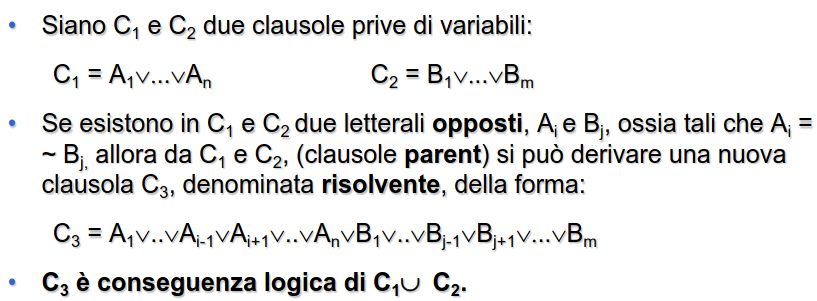
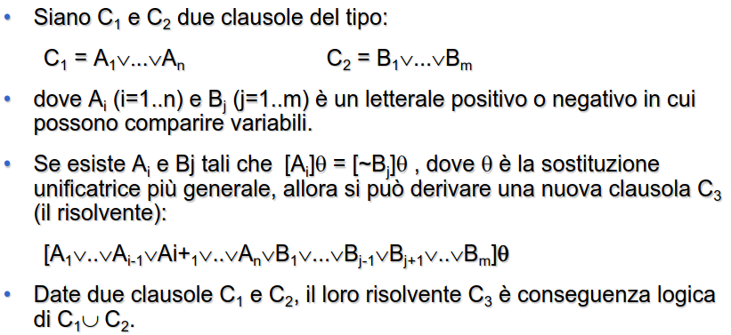
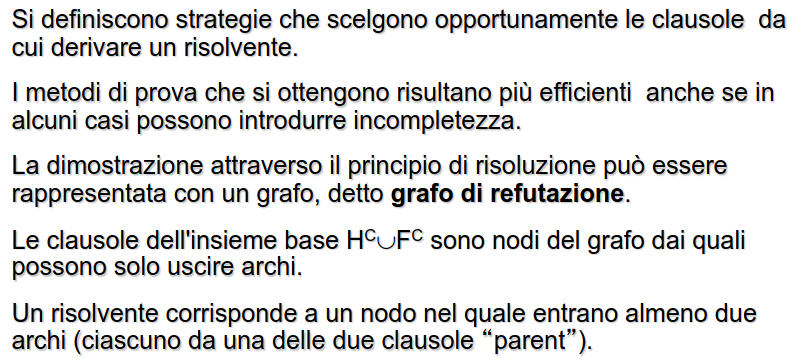
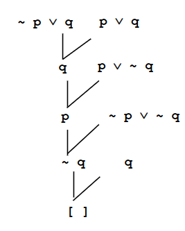
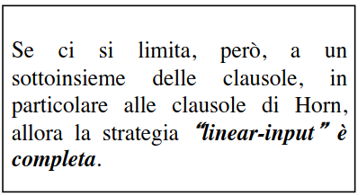

- logica piu semplice, molto meno espressiva
- ### CLAUSOLE
  id:: 643939d1-0c3a-436d-89a8-185a0bb44187
	- disgiunzione di letterali negati e non negati
	- ##### esempio
		- `A1 v A2 v ... v AN v ~B1 v ... v ~BN`
	- #### CLAUSOLE DEFINITE
		- sottoinsieme delle clausole generali
		- clausole in cui un **solo letterale è positivo**
- ## DIMOSTRAZIONI IN LOGICA PROPOSIZIONALE
	- ### RISOLUZIONE
		- #### PRINCIPIO DI RISOLUZIONE
			- si applica a formule logiche espresse in forma a ((643939d1-0c3a-436d-89a8-185a0bb44187))
			- regola di inferenza base usata nella logica
			- 
			- crea una nuova clausola escludendo i letterali opposti
			- si ha che C3 è ((64392ba2-1bc5-46a5-b086-6184ff3b783f)) di C1 e C2
		- dati gli assiomi di una teoria `H` e una formula `F` derivando `H U ~F` si dimostra che `F` è un **teorema della teoria**
	- ### FORWARD CHAINING
	- ### BACKWARD CHAINING
	- ### CLAUSOLE GENERALI
		- clausole in cui possono comparire variabili
		- 
	- ### CORRETTEZZA E COMPLETEZZA
		- sotto opportune strategie di ricerca la risoluzione è **corretta e completa**
		- #### TEOREMA DI CORRETTEZZA E COMPLETEZZA DELLA SOLUZIONE
			- un insieme di clausole è insoddisfacibile se l'algoritmo di risoluzione termina in un numero finito di passi generando la clausola vuota
	- ### STRATEGIE
		- 
		- #### STRATEGIA IN AMPIEZZA
			- al passo I>0 si generano tutti i possibili risolventi al livello i+1-esimo sfruttando come clausola parent la  clausola Ci-esima e una clausola Cj con j<=i
			- non molto efficiente
			- occupa molta memoria
		- #### STRATEGIA LINEARE
			- una delle due clausole parent è sempre quella generata al passo precedente
			- la struttura dati risultante è un **albero lineare**
			- ##### esempio
				- 
		- entrambe le strategie sono **complete ma inefficienti**
		- esistono strategie non complete
		- #### LINEAR INPUT
			- una delle clausole parent è quella determinata al passo precedente mentre l'altra fa sempre **parte dell'insieme iniziale**
			- si **memorizza solo l'ultimo risolvente**
			- la strategia **non è completa**
			- 
		-
	- [[CLAUSOLE DI HORN]]