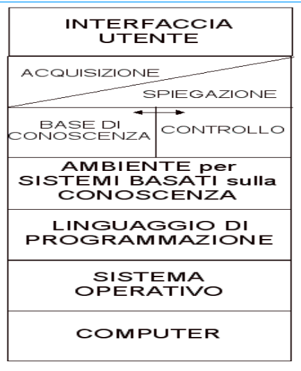

- ambiente in cui elaborare una **BASE DI CONOSCENZA**
- tipologie di conoscenza
- #### BASE DI CONOSCENZA
  id:: 64099770-7277-4ef6-a541-193c3a25094a
	- conoscenza sul dominio dell'applicazione
- #### CONTROLLO
  id:: 6409977e-c77f-48fd-b090-0267232dc9cd
	- conoscenza su come sfruttare la conoscenza per risolvere i problemi
- quindi un programma è formato da ((64099770-7277-4ef6-a541-193c3a25094a)) e ((6409977e-c77f-48fd-b090-0267232dc9cd))
-
- Questa struttura costringe a rivedere lo stack infrastrutturale
- gli ambienti prediligono un approccio dichiarativo
- #### VANTAGGI
	- si esprime la conoscenza ad alto livello (maggiore espressività)
	- generalità maggiore
	- flessibilità maggiore
- 
- [[ESEMPIO PRESCRIBE DRUG]]
- ### STRUTTURA DEL PROGRAMMA
	- un programma è composto da:
		- **operatori**
		- **memoria di lavoro**
		- **strategia di controllo**
	- due approcci al problema
		- [[forward o data driven]]
		- [[backward]]
		- ### quale scegliere?
			- dipende dal numero di stati iniziali e dai goal, è piu efficiente partire da dove si hanno meno elementi per evitare di esplorare inutilmente sottoalberi
			- dipende anche dal numero di rami che un nodo puo generare
			- quale approccio consente all'utente di interagire in maniera naturale
		- ### approccio ibrido
			- è la combinazione degli approcci sopracitati
			- la memoria di lavoro è suddivisa in due parti per svolgere entrambe le funzionalità
			- la condizione di terminazione si ha quando la memoria di lavoro ricavata in modo backward è uguale o un sottoinsieme di quella ricavata forward
		-
			-
			-
			-
			-