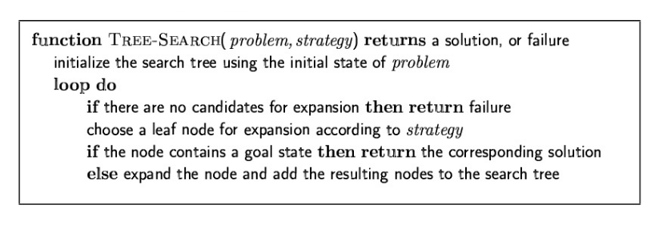

- l'agente deve mantenere in memoria una serie di soluzioni parziali che conducono a un esito sconosciuto da poter analizzare
	- #### processo di ricerca
		- inteso come la costruzione di un albero
			- nodi= stati
			- rami= operatori
		- ad ogni azione si deve decidere quale stato espandere
		- #### fase di espansione
			- l'agente genera il sottoalbero dato un operatore e uno stato iniziale
			- l'agente non attua l'operatore, genera solo l'albero
			- ##### quale  ramo espandere?
				- situazione di non determinismo
				- necessario adottare strategia di espansione
			- arrivato alle foglie dell'albero l'agente può avere due possibilità
				- foglia GOAL
				- foglia FALLIMENTO
			-
		- 
		- #### ESEMPIO
			- ricerca del percorso da Arad a Bucharest
			- 
		- #### CONTENUTO DEL NODO
			- stato che rappresenta
			- operatore applicato per ottenere il nodo
			- costo del cammino dallo stato iniziale
			- la profondita del nodo
			- link ai nodi figli e al nodo padre
		- #### PSEUDO IMPLEMENTAZIONE
		- 
			- l'agente partendo da un problema genera il nodo radice
			- lo inserisce nella lista di nodi
			- verifica se il nodo è il goal
				- se è il goal genera la sequenza di azioni per raggiungerlo
				- se non lo è espande la lista e ripete
					- vengono generati i nodi successori visti come un insieme di azione e stato
					- memorizza la profondità del nodo
					- costruisce la struttura e la restituisce
		- ##### IL SISTEMA RIESCE A TROVARE UNA SOLUZIONE?
			- è possibile non trovarne come trovarne di sbagliate
		- ##### È UNA SOLUZIONE OTTIMA?
			- con costo minore di cammino
		- ##### QUAL'È IL COSTO DELLA RICERCA?
			- costo del cammino + costo della ricerca
- [[STRATEGIE DI RICERCA]]
-
	-