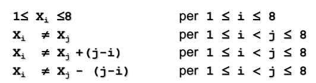

- molti problemi possono essere visti come soddisfacimento di vincoli
- CSP (constraint satisfaction problem)
- **OBBIETTIVO**
	- trovare uno stato del problema che li soddisfa
- #### DEFINIZIONE
- (x1,....,xn) insieme di variabili
- (d1,......,dn) valori ammissibili
- #### ESEMPI
	- ##### ESEMPIO DELLE 8 REGINE
		- 
		- 
	- ##### ESEMPIO DELLO SCHEDULING
		- assegnare attività che hanno una certa durata a risorse
		- 
	- ##### ESEMPIO MAP COLORING
		- 
		- 
	- ##### ESEMPIO CRIPTOARITMETICA
		- 
- #### CSP COME PROBLEMA DI RICERCA NELLO SPAZIO DEGLI STATI
	- **stato**
		- è dato dalle variabili e  da un set dei possibili valori determinati dai domini
	- **goal test**
		- è l'insieme dei vincoli che quelle variabili devono rispettare
	- **nodi foglia**
		- nodi in cui tutte le variabili hanno un valore
	- **operatori**
		- assegnamenti di valori alle variabili
	- ##### POSSIBILI ALGORITMI DI RICERCA
		- #### ALGORITMO GENERATE AND TEST
		  id:: 6426b5e0-9f44-421d-ad8d-7e9b1b479b99
			- 
			- viene prima generata la soluzione  e poi testato se rispetta i vincoli richiesti dal problema
			- vincoli considerati in maniera passiva
			- non viene propagata nessuna forma di *conoscenza*
			- questo approccio fa si che la complessità esploda rapidamente
				- si possono espandere alberi che sono errati fin dalla prima variabile
			- corretto approccio **rilevare subito i rami di fallimento**
		- #### ALGORITMO STANDARD BACKTRACKING
			- a ogni istanziazione di variabile viene eseguito un controllo sulla correttezza dei vincoli
			- più efficiente di ((6426b5e0-9f44-421d-ad8d-7e9b1b479b99))
			- ##### esempio
				- 
			- ##### implementazione
				- 
	- questi algoritmi prevedono di utilizzare i vincoli su variabili gia assegnate
	- non sono in grado di anticipare eventuali stati di fallimento
		- ##### esempio
			- 
	- questo limite è dovuto all'uso a **posteriori dei vincoli**
	- soluzione: utilizzare vincoli in **maniera attiva**
		- a ogni assegnamento vengono modificati i domini delle variabili non assegnate
		- escludo a priori casi di fallimento certi a priori
		- #### ALGORITMI DI PROPAGAZIONE
		  id:: 6426bb50-4d3c-4bb7-885b-03f5d4cf0b9a
			- algoritmi in grado di escludere rami errati a priori
			- ##### FORWARD CHECKING
				- dopo ogni assegnamento viene  eseguita la propagazione dei vincoli
				- vengono eliminati i valori dai domini delle variabili non istanziate che risultano incompatibili con i vincoli
				- se si arriva a un dominio vuoto l'algoritmo fallisce **senza tentare backtracking**
			- ##### PARTIAL LOOK AHEAD
				- oltre a eseguire la propagazione dei vincoli si testa se esiste un valore per cui sia possibile trovare per tutte le altre variabili un valore compatibile
				- **CONSIDERA SOLO LA VARIABILE CHE È STATA ASSEGNATA NON ESEGUE TEST SUCCESSIVI**
			- ##### FULL LOOK AHEAD
				- viene eseguita una propagazione dei vincoli considerando anche le variabili successive a quella assegnata
				- **CONSIDERA SIA LA COMPATIBILITÀ CON L'ATTUALE ASSEGNAMENTO E QUELLA CON GLI ASSEGNAMENTI SUCCESSIVI**
			- #### differenze
				- il dominio si riduce in maniera diversa
				- aumenta la complessita computazionale dell'algoritmo
		- #### GRADI DI LIBERTA
			- ##### EURISTICHE SULLA STRATEGIA DI RICERCA
				- scelta di ordinamento delle variabili
				- scelta nell'ordine di associazione dei valori alle variabili
			- propagazione effettuata in ciascun nodo
		- #### classificazioni delle euristiche
			- ##### DINAMICHE
				- ordinamento definito a runtime
				- algoritmo MRV e most-constrained principle
			- ##### STATICHE
				- ordinamento definito a priori
- ### APPROCCI D'ATTACCO
	- ((6426bb50-4d3c-4bb7-885b-03f5d4cf0b9a))
	- [[TECNICHE DI CONSISTENZA]]
- ### CONSTRAINT SOLVER IN PRATICA
	- i constraint solver vengono implementati solitamente usando algoritmi di labeling e sfruttando particolari caratteristiche del dominio
	- (*X::[1..10], Y::[1..10], X > Y. Non importa controllare tutti i valori nei due domini, ma basta controllare i bound. In particolare questo vincolo è AC se min(X) > min(Y) and max(X) > max(Y)*)
- ### CONSTRAINT OPTIMIZATION PROBLEM
	- CSP in cui viene aggiunto un **obbiettivo di ottimizzazione** (*ricerca della soluzione ottima secondo qualche parametro*)
	- si aggiunge una variabile che rappresenta la **funzione obbiettivo**
	- ogni volta che viene risolto il CSP si aggiorna il vincolo della funzione obbiettivo, una volta che sono esplorate tutte le soluzioni si ottiene la funzione obbiettivo
	-
-