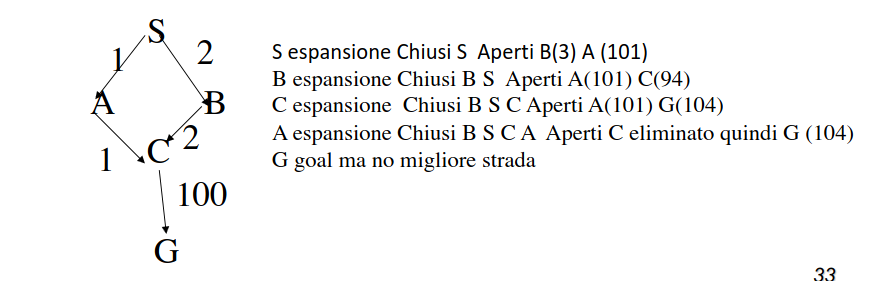

- necessario applicare qualche tipo di logica all'espansione dell'albero basata sulla conoscenza che il sistema possiede del dominio
- #### FUNZIONI DI VALUTAZIONE
  id:: 6412da4c-6f41-4461-b8ae-877df23eb259
	- calcolano lo sforzo computazionale per raggiungere lo stato finale
- #### RICERCA BEST FIRST
	- scegliere il nodo piu desiderabile per l'espansione
	- sfrutta ((6412da4c-6f41-4461-b8ae-877df23eb259)) per determinare qual'è il ramo piu desiderabile
	- ##### RICERCA GREEDY
		- la funzione di valutazione restituisce la distanza dal goal
		- non considera il costo del percorso
		- non è detto che trovi il cammino migliore
	- ##### RICERCA A*
		- considera la distanza del nodo dal goal e il costo per raggiungerlo
		- TODO completare sessione
	-
- #### DA ALBERI A GRAFI
	- negli esempi non abbiamo preso in considerazione la possibilità di ritornare a uno stato gia visitato
	- ##### lista nodi chiusi
	  id:: 6412ec52-8f3f-47b9-a6b0-cfa0af3c6c70
		- per sopperire a questo problema necessaria una lista di nodi già espansi (**nodi chiusi**)
	- se si mantengono nella ((6412ec52-8f3f-47b9-a6b0-cfa0af3c6c70)) solo gli stati si è più efficienti ma non è garantita la ottimalità della soluzione
	- 
- #### EURISTICA CONSISTENTE
	- una euristica e’ consistente se per ogni nodo n, ogni
	  successore n' di n generato da ogni azione a
		- h(n)=0 se lo stato coincide con il goal
		- h(n)=< c(n,a,n') +h(n')
	-
	-
	-
	-
	-