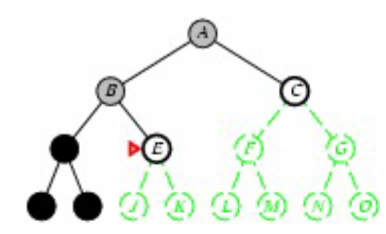
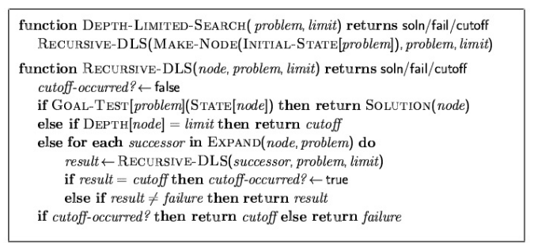

- #### STRATEGIA BREADTH-FIRST
  id:: 640b1d0a-beb1-4247-b1ba-59bf87d88dec
	- espande sempre i nodi meno profondi dell'albero
	- ((640b1c46-7eb7-4316-a186-682e4ef1557d)) e ((640b1c39-c598-41a4-8a47-e7417df9bbb8)) b^d
		- complessità esponenziale di esecuzione
	- trova sempre la soluzione ottimale se il costo è indicato come la profondità del goal
- #### STRATEGIA A COSTO UNIFORME
	- viene selezionato per l'espansione il nodo a costo minimo
	- il goal test viene effettuato prima dell'espansione del nodo
- #### STRATEGIA DEPTH-FIRST
  id:: 640b20a1-4658-4b89-b6a5-654c8667fd14
	- espande i nodi piu profondi
		- a parita di profondita la selezione è arbitraria
	- ((640b1c39-c598-41a4-8a47-e7417df9bbb8)) ridotta rispetto a ((640b1d0a-beb1-4247-b1ba-59bf87d88dec)) non è necessario tenere attivi tutti i rami dell'albero una volta esplorati
	- 
	- possibile gestirla con uno stack
	- ((640b1c21-d260-46d3-bc78-cb50f97d63cc))
		- la strategia non è completa, in caso di rami di profondità infinita o loop
		- un workaround possibile è quello di imporre un limite alla profondità massima raggiungibile
	- ((640b1c46-7eb7-4316-a186-682e4ef1557d))
		- se la profondita dell' albero è molto maggiore della profondita della soluzione tempi lunghissimi
	- ((640b1c39-c598-41a4-8a47-e7417df9bbb8))
		- lineare con la dimensione dell'albero
	- ((640b1c4b-fe83-4c82-be38-9c458cd40b5d))
		- la strategia non è ottimale
	- 
#### RICERCA AD APPROFONDIMENTO ITERATIVO
	- TODO approfondire nelle slide
-
	-
	-
	-
	-