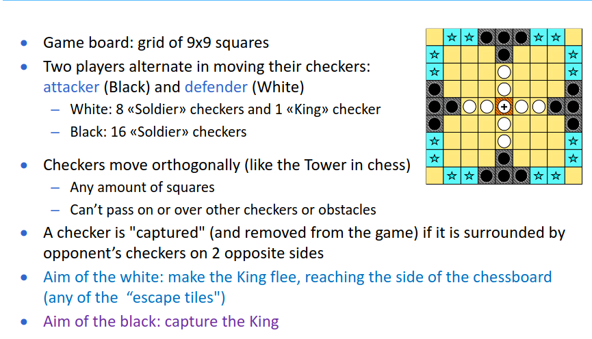
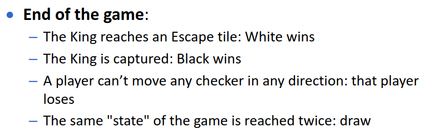

- si gioca a tablut
	- nessuno sa le regole arrivano da una traduzione dal latino di un tizio che guardava  dei tizi giocare
	- 
	- {:height 165, :width 501}
	- check [rules](https://virtuale.unibo.it/pluginfile.php/1589188/mod_resource/content/0/PresentazioneChallenge2223.pdf)
	- si puo partecipare a gruppi max 4 persone
	- timeout di un minuto massimo
	- server java che comunica all'agente lo stato del gioco e si attende la mossa
	- discussione post gara del giocatore
	- scadenza consegna [[May 14th, 2023]]
	- scadenza iscrizione non obbligatoria [[Apr 16th, 2023]] [link per iscrizione](https://virtuale.unibo.it/mod/assign/view.php?id=1187248)
	- ambiente di deploy macchina virtuale [vm](https://liveunibo-my.sharepoint.com/:u:/g/personal/andrea_giovine_unibo_it/Eb_-2bR2YNtAs_F7D2i8jFkBY0KWWKfjNIY4-AoGMwVHFA)
	- credenziali: tablut tablut
	- cartella /home/tablut/tablut
	- TODO **CHECK DEPLOYMENT METHODS**
	-
	-
	-
-