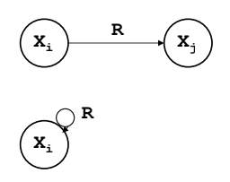
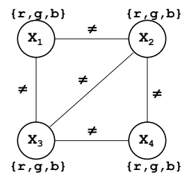
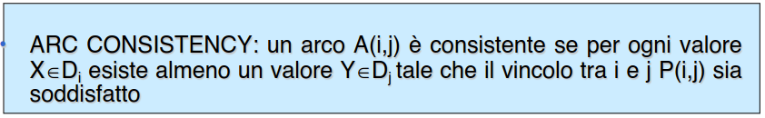
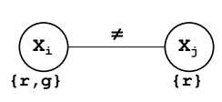
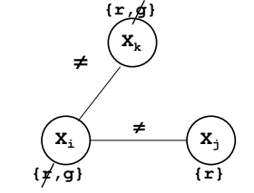
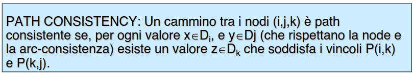

- rimuovono dai domini valori che a priori non fanno parte della soluzione
- CSP rappresentato come **grafo**
- le **variabili sono nodi** del grafo
- i **vincoli sono archi** del grafo
	- (*vincoli ternari possono essere tradotti in binari aggiungendo variabili fantasma*)
- 
- ##### esempio map coloring
	- 
- ## ARCO CONSISTENZA
	- un arco è consistente se per ogni valore di Xi esiste almeno un valore di Y per cui il vncolo è soddisfatto
	- 
	- ##### ESEMPIO ARCO NON CONSISTENTE
		- 
	- il processo di rendere un grafo consistente è un processo **iterativo** a ogni modifica di un dominio il test sulla consistenza va ripetuto
		- 
	- il processo termina quando non viene modificato nessun dominio
	- #### IMPLEMENTAZIONE
		- coda degli archi di cui testare la consistenza
		- a ogni modifica del dominio gli archi a esso legati vengono inseriti nella coda
		- si termina quando la coda è vuota
	- ## PERCORSO CONSISTENTE
		- 
		- #### TEOREMA SULLA PATH CONSISTENZA
			- se ogni cammino di lunghezza 2 è path consistente allora lo è tutta la rete
-